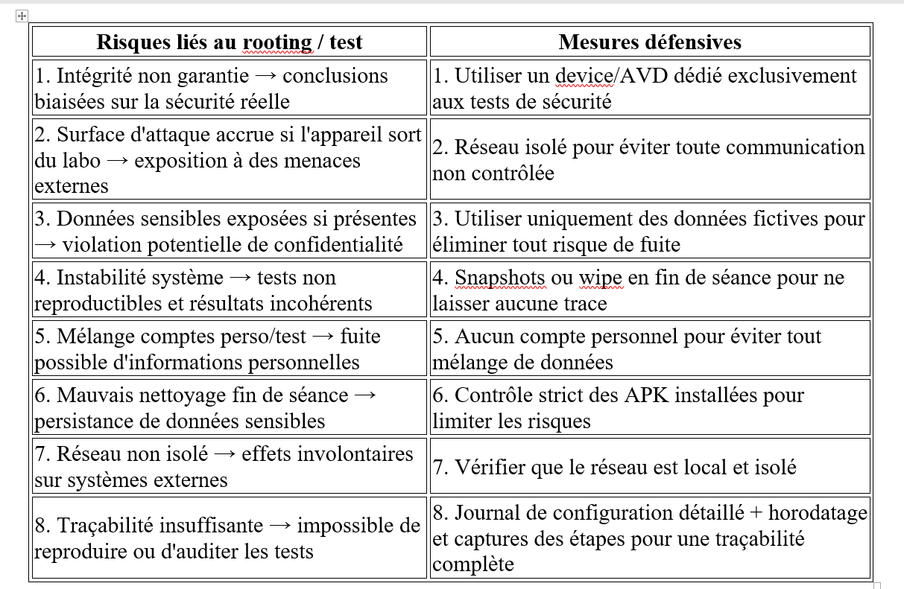

# LAB2
La création d'un AVD:

Application / Version : Android Emulator (API 36 – Android 16.0)
Support : Environnement virtualisé (AVD – Android Virtual Device / Pixel 6)
Objectif : "Comprendre rooting et impacts"
Données : "Fictives"
Réseau : "Test"

Étape 1 : Rooter l'AVD

Interprétation des résultats : 
uid=0 = privilèges root confirmés.
L'AVD est en état orange -> l’intégrité du système n’est plus garantie.
adb shell getprop ro.boot.veritymode:
enforcing -> Cela signifie que l’émulateur utilise overlayfs pour permettre les modifications sans casser totalement le système.

Fichier de Journalisation :

#Livrable:
1) Définition du rooting 

Le rooting consiste à obtenir les privilèges administrateur (root) sur un appareil Android.
Il permet d’accéder à des zones du système normalement protégées.
Le rooting offre la possibilité de modifier des fichiers système et d’installer des applications avec des droits élevés.
Cependant, il compromet la sécurité native et peut exposer le device à des vulnérabilités et des malwares.

2) Schéma simple : Verified Boot / AVB

Chaîne de confiance : Bootloader(vérifie signature de l'image boot) → Kernel (Android Verified Boot)→ System(vérifie intégrité) → Vendor(vérifie intégrité) → Apps .

Chaque étape vérifie la signature de la précédente pour s’assurer qu’aucune modification non autorisée n’a eu lieu.

3) 8 risques du rooting + 8 mesures défensives

4) MASVS : 2 exigences résumées
STORAGE-1 : Les données sensibles comme les API keys, mots de passe ou tokens doivent être stockées de manière sécurisée en utilisant des fonctions de chiffrement appropriées.
NETWORK-1 : Les communications réseau doivent utiliser TLS avec une configuration correcte et vérifier les certificats.

5) MASTG : 2 idées de tests

Vérifier si les fichiers de préférences partagées contiennent des informations sensibles en clair en les examinant directement dans /data/data/[package_name]/shared_prefs/ .
Analyser les logs de l'application avec adb logcat pour détecter des fuites d'informations sensibles pendant l'exécution

