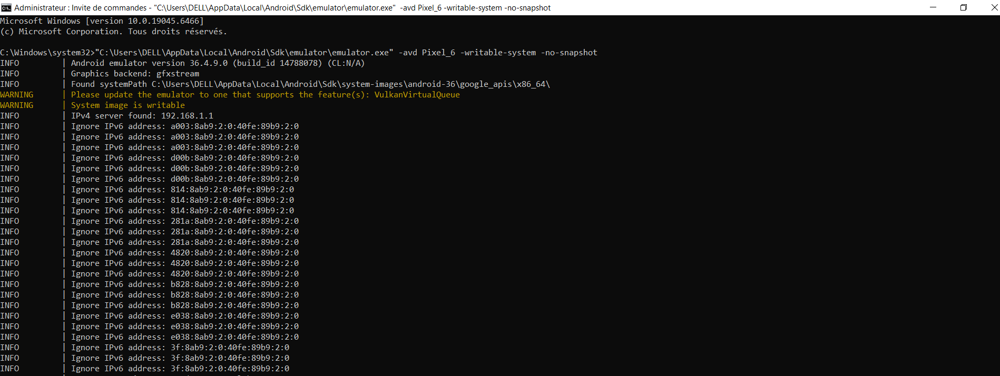
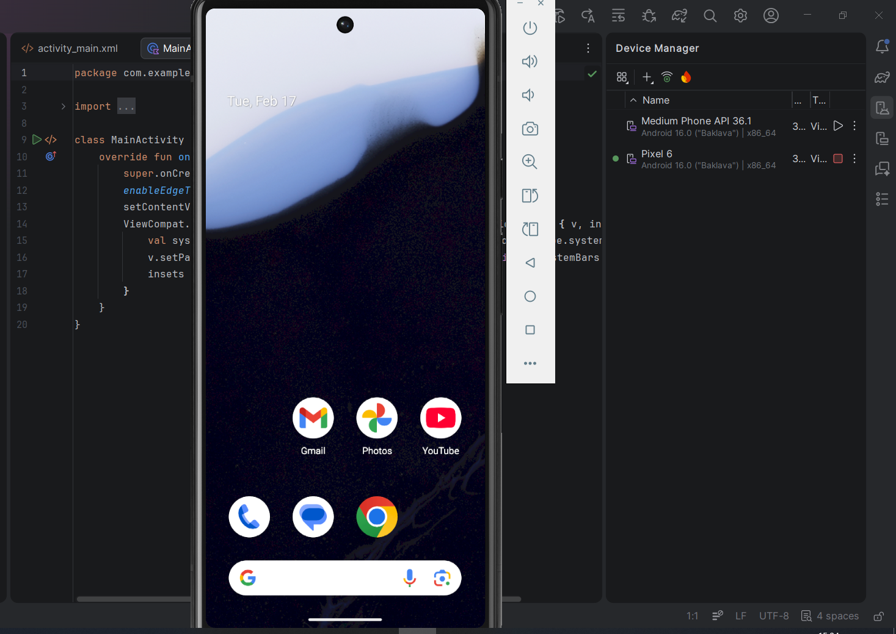
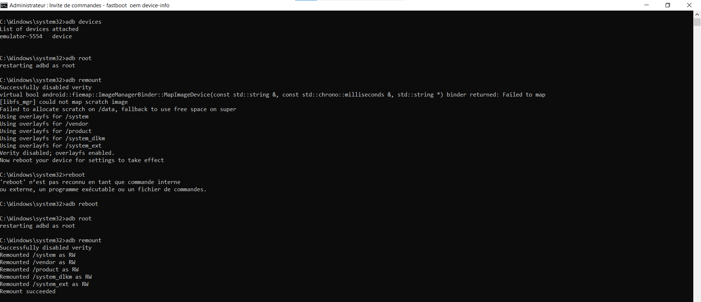
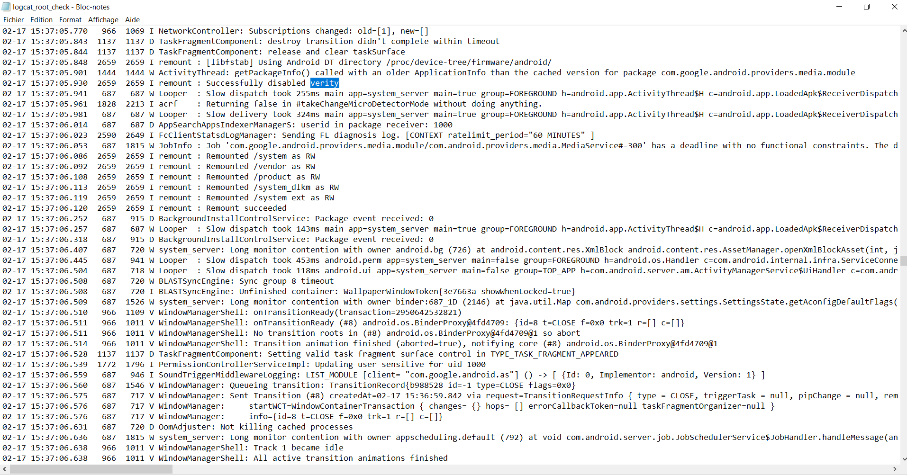

# LAB2
La création d'un AVD:

Application / Version : Android Emulator (API 36 – Android 16.0)
Support : Environnement virtualisé (AVD – Android Virtual Device / Pixel 6)
Objectif : "Comprendre rooting et impacts"
Données : "Fictives"
Réseau : "Test"

Étape 1 : Rooter l'AVD

Interprétation des résultats : 
uid=0 = privilèges root confirmés.
L'AVD est en état orange -> l’intégrité du système n’est plus garantie.
adb shell getprop ro.boot.veritymode:
enforcing -> Cela signifie que l’émulateur utilise overlayfs pour permettre les modifications sans casser totalement le système.

Fichier de Journalisation :

